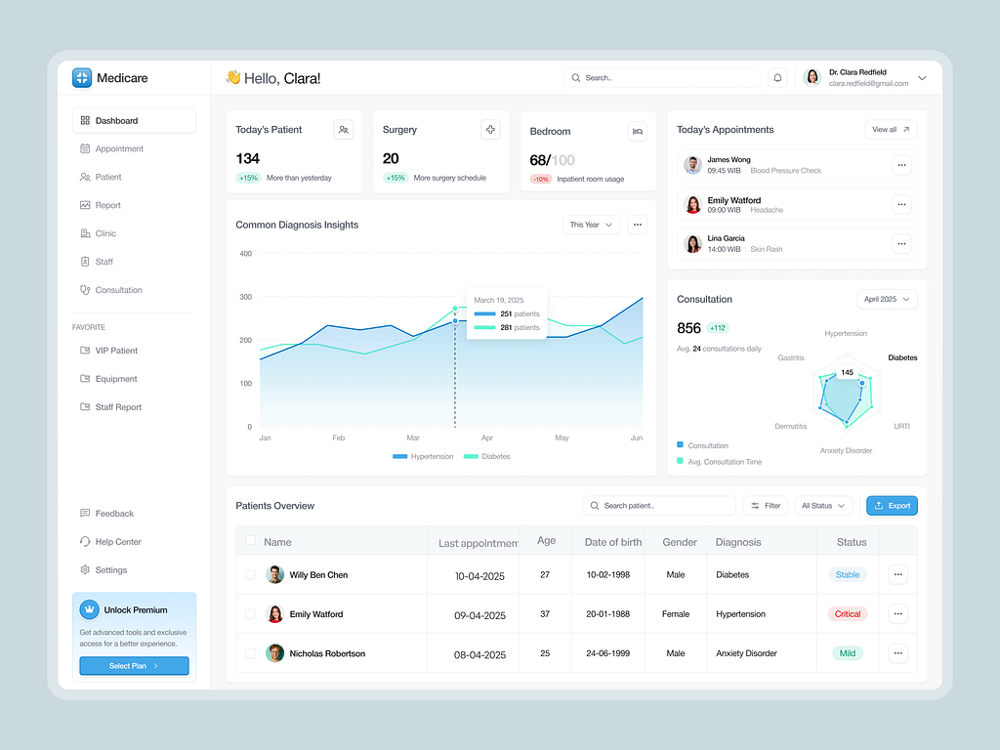

# Virtual Blood Bank (VBB)

A district-level mHealth system that helps rural Ethiopian health facilities share
blood in real time to reduce maternal mortality from postpartum hemorrhage. The
product targets both a mobile and a web client backed by one API:

| Path | Component | Status |
| :--- | :--- | :--- |
| [`backend/`](backend/) | Django REST API (inventory, blood requests, auth, notifications) | ✅ Implemented |
| `mobile/` | Cross-platform mobile client (React Native / Flutter) | 🚧 Planned |
| `web/` | Web client (browser dashboard for facility staff) | 🚧 Planned |

<p align="center">
  
  <br>
  <em>UI design reference for the planned facility dashboard — patient/appointment-style overview panels that the VBB clients will adapt for blood inventory, requests, and alerts.</em>
</p>

## Repository layout

```
backend/      # Django + DRF API — see backend/README.md to run it
docs/         # Product & architecture docs (authoritative SRS.pdf / SDS.pdf, ADRs, runbooks)
resources/    # Design references and other assets
render.yaml   # Render deployment blueprint (builds ./backend)
mobile/       # Mobile client (future)
web/          # Web client (future)
```

## Getting started

The backend is self-contained. To run it:

```sh
cd backend
cp .env.example .env
make setup
```

See [`backend/README.md`](backend/README.md) for full setup, API reference, and
architecture notes, and [`docs/README.md`](docs/README.md) for the documentation map.

## Documentation

- **Authoritative specs:** [`docs/SRS.pdf`](docs/SRS.pdf), [`docs/SDS.pdf`](docs/SDS.pdf)
- **API contract:** [`docs/api/API.md`](docs/api/API.md)
- **Domain context:** [`docs/CONTEXT.md`](docs/CONTEXT.md)
- **Architecture decisions:** [`docs/architecture/decisions/`](docs/architecture/decisions/)
- **Runbooks (deploy, dispatcher, incidents):** [`docs/runbooks/`](docs/runbooks/)
- **Changelog:** [`CHANGELOG.md`](CHANGELOG.md)
